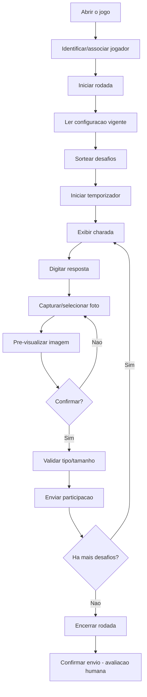
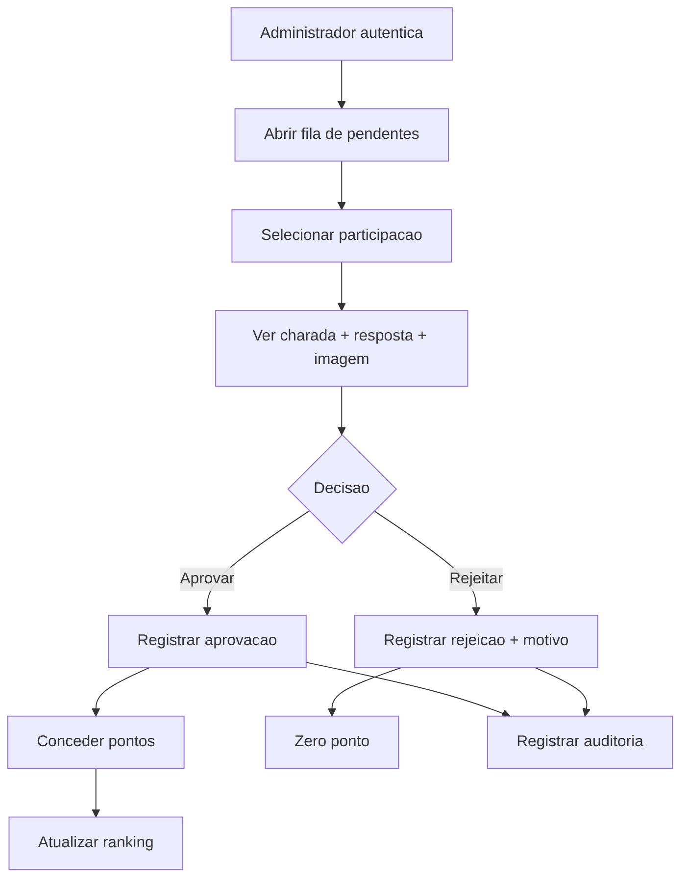
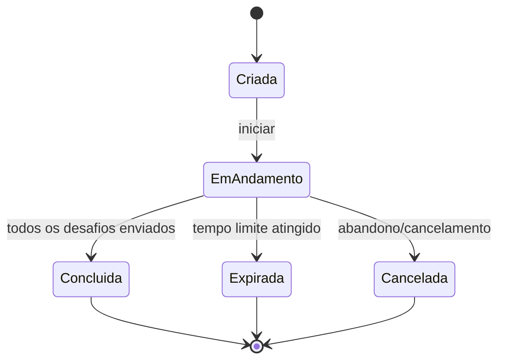
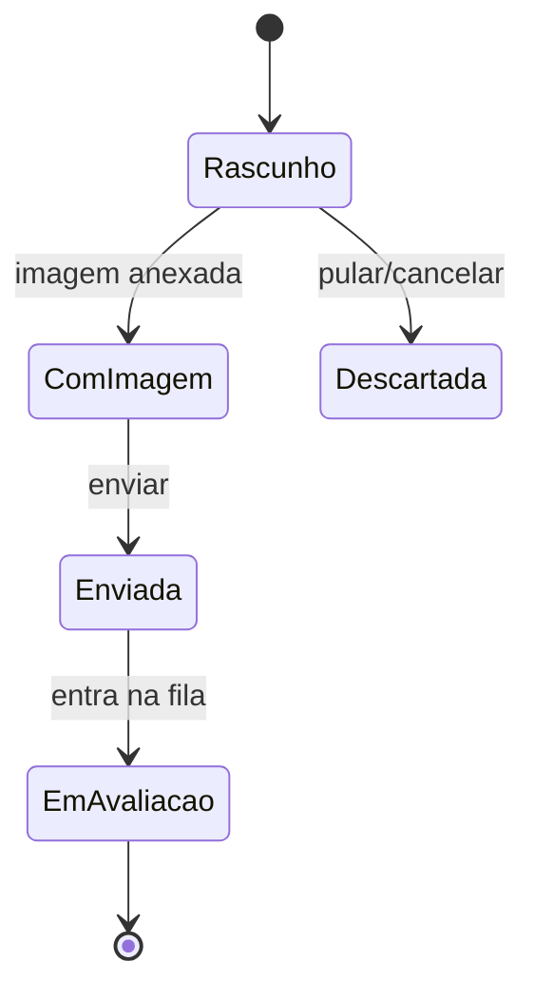
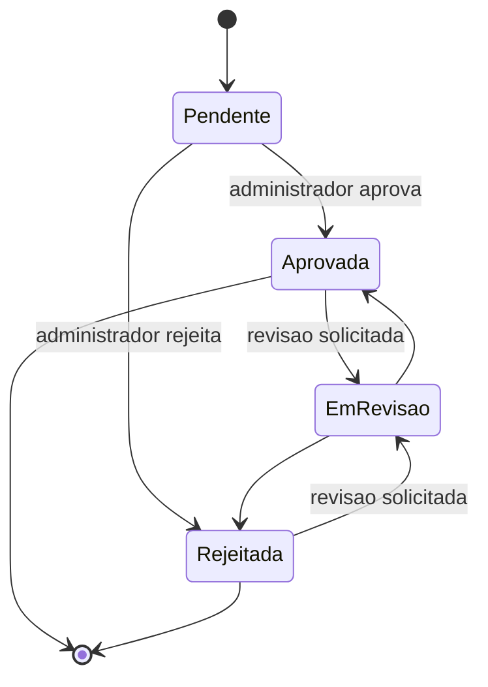
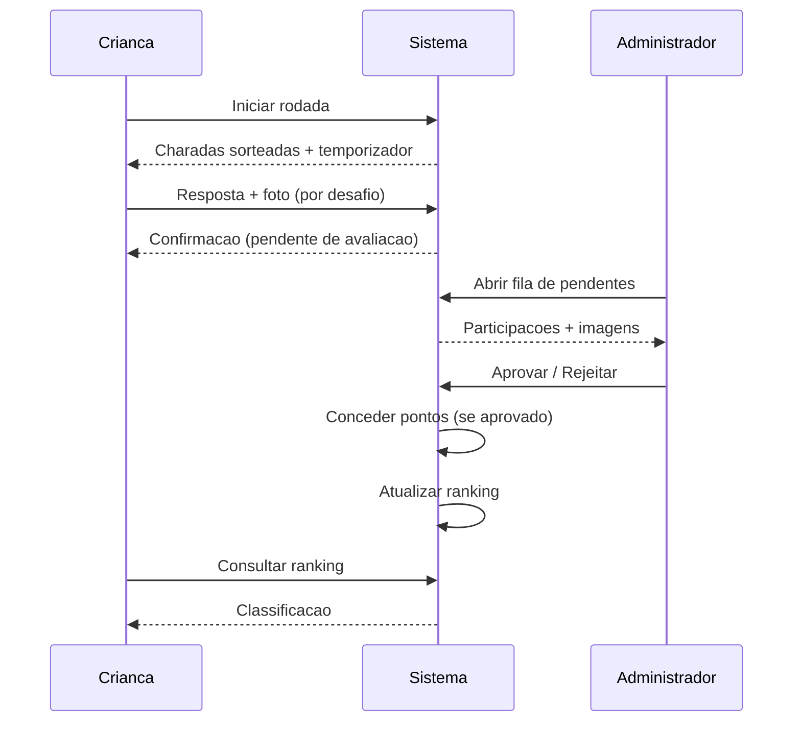

# 04 — Fluxos do sistema

> Diagramas em Mermaid. Estados e transições marcados com `HIPÓTESE`/`PENDENTE`
> dependem de decisões futuras (ver [decisões pendentes](12-decisoes-pendentes.md)).

## 1. Fluxo do jogador

## 2. Fluxo de avaliação

## 3. Estados de uma rodada (`GameSession`)

> `Expirada` e `Cancelada` são `HIPÓTESE`. O comportamento exato ao expirar é
> `PENDENTE` (ver [regras de negócio](02-regras-de-negocio.md), `RN-TMP`).

## 4. Estados de uma resposta (`PlayerAnswer`)

> `Rascunho`/`Descartada` dependem de salvamento progressivo (`HIPÓTESE`) e de
> permitir pular charada (`HIPÓTESE`).

## 5. Estados de uma avaliação (`Evaluation`)

> `EmRevisao` é `HIPÓTESE` (ver `RN-AVA-005`).

## 6. Visão de ciclo de vida (ponta a ponta)

## Referências cruzadas

- [Regras de negócio](02-regras-de-negocio.md)
- [Personas e jornadas](03-personas-e-jornadas.md)
- [Modelo de domínio](05-modelo-de-dominio.md)
