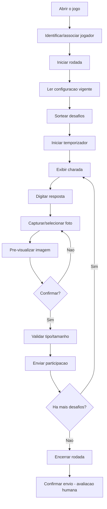
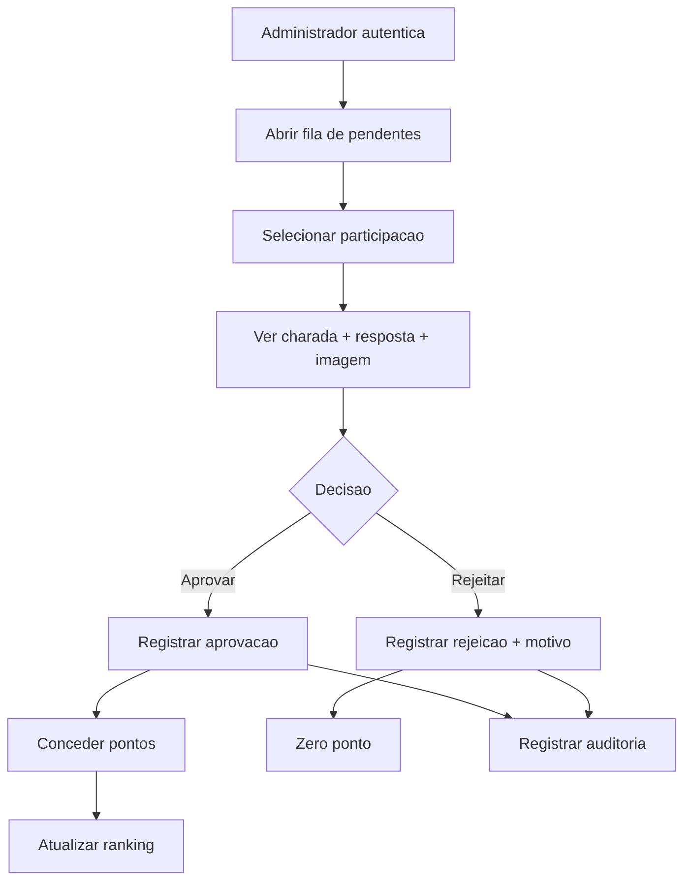
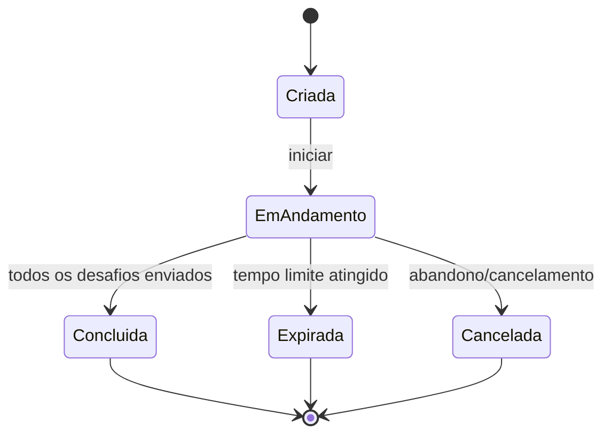
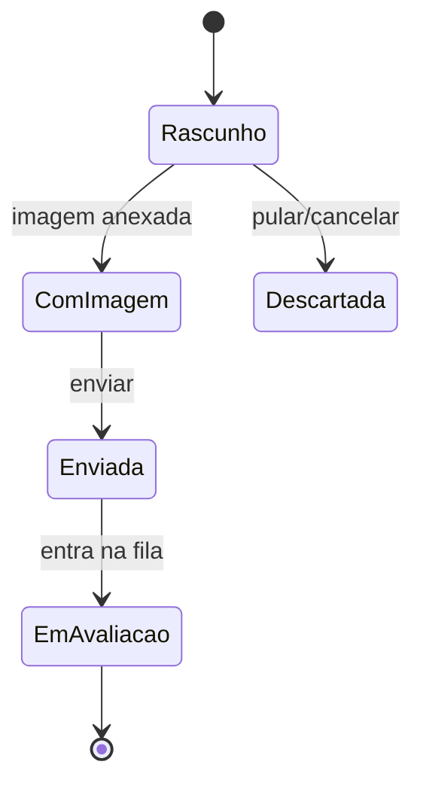
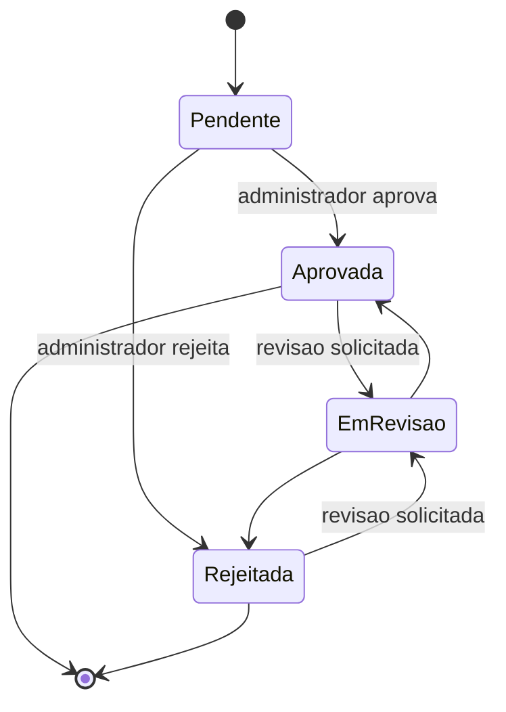
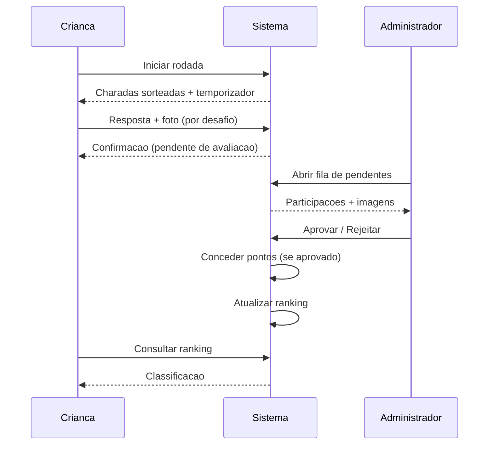

# 04 — Fluxos do sistema

> Diagramas em Mermaid. Estados e transições marcados com `HIPÓTESE`/`PENDENTE`
> dependem de decisões futuras (ver [decisões pendentes](12-decisoes-pendentes.md)).

> **Fotografia obrigatória (CONFIRMADO — 1ª versão):** o envio de uma
> participação exige uma **fotografia válida**; um rascunho pode existir sem
> imagem, mas não é enviável sem ela (ver [RN-FOT-003](02-regras-de-negocio.md)).
>
> **Decisões consolidadas (6 ago 2026)** — ver [pacote](13-pacote-decisoes-mvp.md):
> - **Pular (DEC-008):** a criança pode pular um desafio não enviado (estado
>   `pulado`, zero ponto, sem troca).
> - **Expiração (DEC-009):** ao expirar, **apenas respostas completas** (texto +
>   foto válida confirmada) são **enviadas automaticamente** (uma vez); texto sem
>   foto vira histórico somente leitura; uploads iniciados antes do prazo só
>   concluem dentro de `upload_grace_seconds` (60 s), senão o objeto órfão é
>   removido. Preserva-se o que já foi salvo; sem retomada no MVP.
> - **Gate de mídia (DEC-002/018):** câmera/galeria/upload exigem responsável
>   autenticado + consentimento.

## 1. Fluxo do jogador

## 2. Fluxo de avaliação

## 3. Estados de uma rodada (`GameSession`)

> **`Expirada` é CONFIRMADO** (DEC-009; `RN-TMP-002/003/004`; `RN-EXP-001..005`):
> o **servidor é a autoridade do tempo** e a rodada expira ao atingir o limite. A
> transição temporal `EmAndamento → Expirada` (`IN_PROGRESS → EXPIRED`) já é
> aplicada de forma **atômica** no backend, com `endedAt = expiresAt` (nunca o
> relógio de detecção) — ver `src/modules/round` (`expireRoundIfDue`). Os
> **efeitos** sobre respostas/imagens ao expirar (`RN-EXP-002..005`) são regras
> confirmadas, mas dependem de módulos futuros (`PlayerAnswer`/upload). `Cancelada`
> permanece **`HIPÓTESE`** (`RN-CAN`, não implementada nesta fatia).

## 4. Estados de uma resposta (`PlayerAnswer`)

> **`Rascunho` (DRAFT) textual tem suporte de backend** (`saveAnswerDraft` em
> `src/modules/round`): o texto digitado é **persistido literalmente** (sem
> normalização/correção), com no máximo **um `PlayerAnswer` por desafio**, editável
> apenas enquanto a rodada estiver `IN_PROGRESS` dentro do prazo; após a expiração
> (servidor é a autoridade), **novas alterações são bloqueadas** e o texto já salvo
> permanece persistido. As **demais transições não estão implementadas**:
> `ComImagem`/`Enviada`/`EmAvaliacao` (dependem de imagem/submissão/avaliação) e a
> classificação `DRAFT → PRESERVED_AFTER_EXPIRATION` (depende do estado futuro de
> `SubmittedImage`, `RN-EXP-002..005`). **Pular** é **CONFIRMADO** (DEC-008 /
> `RN-PUL-001..003`; estado `pulado`, zero ponto, sem troca), mas **não** foi
> implementado nesta fatia. A cadência/política de autosave da UI permanece
> **`HIPÓTESE`** (`RNF-PERF-003`).

## 5. Estados de uma avaliação (`Evaluation`)

> `EmRevisao` é `HIPÓTESE` (ver `RN-AVA-005`).

## 6. Visão de ciclo de vida (ponta a ponta)

## Referências cruzadas

- [Regras de negócio](02-regras-de-negocio.md)
- [Personas e jornadas](03-personas-e-jornadas.md)
- [Modelo de domínio](05-modelo-de-dominio.md)
