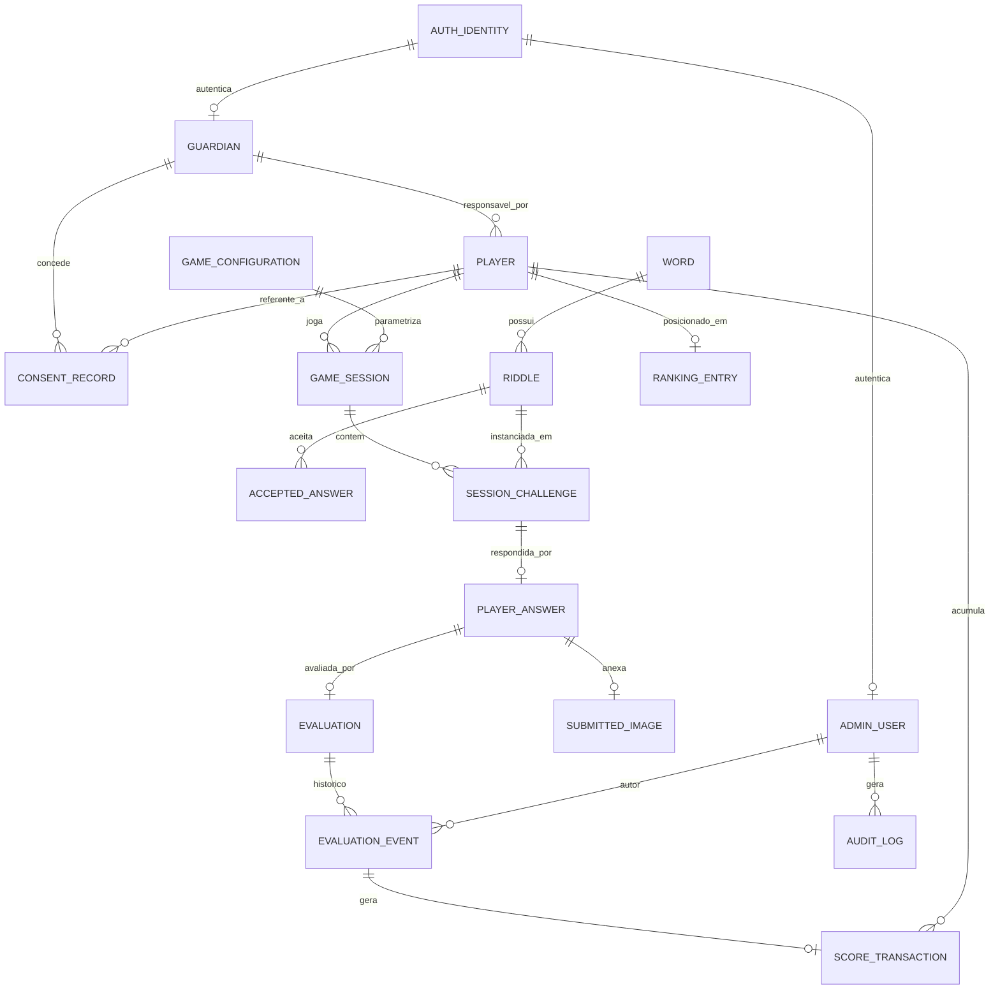

# 05 — Modelo de domínio

> Modelo conceitual. **Os nomes de entidades são propostas, não decisões
> definitivas.** Este documento descreve responsabilidades e relacionamentos; o
> detalhamento de campos está em [modelo de dados inicial](07-modelo-de-dados-inicial.md).

> 📦 As **decisões de produto do MVP foram registradas** (ver
> [13 — Pacote de decisões do MVP](13-pacote-decisoes-mvp.md)): identificação,
> responsável, pontuação, desempate, expiração, cardinalidades e pular estão
> **resolvidas** e refletidas abaixo. **Itens jurídicos permanecem parciais**
> (consentimento, retenção, faixa etária). O pacote preserva as análises
> originais como **histórico**.

## Entidades propostas

| Entidade | Responsabilidade | Status |
| -------- | ---------------- | ------ |
| **Player** | Criança jogadora: UUID interno, apelido público e `access_code_hash` (código = credencial). | CONFIRMADO (DEC-001) |
| **Guardian** | Adulto responsável **persistente** vinculado a criança(s); exigido antes do gate de foto. | ⚠️ PARCIAL (DEC-002; jurídico pendente) |
| **AuthIdentity** | Identidade de autenticação de **contas adultas** (e-mail/Google), separada do perfil de domínio. | HIPÓTESE (solução de auth futura) |
| **ConsentRecord** | Registro **append-only** de consentimento (concessão/revogação, versão, data, origem, escopo). | ⚠️ PARCIAL (DEC-018; jurídico pendente) |
| **AdminUser** | Usuário do painel administrativo; cadastra conteúdo e avalia. | CONFIRMADO |
| **Word** | Palavra-alvo do acervo. | CONFIRMADO |
| **Riddle** | Charada associada a uma palavra. | CONFIRMADO |
| **AcceptedAnswer** | Texto aceito como correto para uma charada. | CONFIRMADO |
| **GameConfiguration** | Parâmetros da rodada (qtd. de desafios, tempo limite, pontuação). | CONFIRMADO |
| **GameSession** | Uma rodada jogada por um jogador. | CONFIRMADO |
| **SessionChallenge** | Instância de uma charada dentro de uma rodada. | CONFIRMADO |
| **PlayerAnswer** | Resposta textual da criança para um desafio. | CONFIRMADO |
| **SubmittedImage** | Fotografia enviada junto à resposta. | CONFIRMADO |
| **Evaluation** | **Agregado** e estado atual da avaliação de uma participação. Pode existir **pendente sem nenhum evento**; após a 1ª decisão, o estado deriva dos eventos. | CONFIRMADO |
| **EvaluationEvent** | Evento **append-only** de decisão/revisão/correção (autor, resultado, motivo, data); trilha auditável. **Zero antes da 1ª decisão.** | CONFIRMADO |
| **ScoreTransaction** | Registro rastreável de pontos (positivo ou **compensatório**); idempotente por **`evaluation_event_id`** (um evento → no máx. uma transação). | CONFIRMADO (DEC-003) |
| **RankingEntry** | **Projeção derivada** (ranking denso; empate compartilha posição; UUID só p/ ordenação técnica). | CONFIRMADO (DEC-004) |
| **AuditLog** | Registro imutável de ações administrativas. | HIPÓTESE |

## Responsabilidades e relacionamentos

- **Word → Riddle:** uma palavra possui **uma ou mais** charadas (**1:N**,
  DEC-006); uma charada pertence a **exatamente uma** palavra.
- **Riddle → AcceptedAnswer:** uma charada possui **uma ou mais** respostas
  aceitas (**1:N**, DEC-005).
- **Guardian → Player:** um responsável vincula **N crianças**; **um responsável
  principal por criança** no MVP; o vínculo é **necessário antes do gate de
  mídia** (câmera/galeria/upload).
- **AuthIdentity → (Guardian | AdminUser):** identidade de autenticação de
  contas adultas, separada do perfil de domínio.
- **ConsentRecord:** registros **append-only** ligados a responsável+criança/
  escopo; o **estado de consentimento deriva dos registros** (não de um campo em
  `Guardian`).
- **Player → GameSession:** um jogador identificado joga **N rodadas** (**1:N**).
- **GameConfiguration → GameSession:** a rodada guarda um **snapshot** dos
  valores usados (pontos por aprovação, `upload_grace_seconds`, quantidade de
  desafios, tempo limite).
- **GameSession → SessionChallenge:** a rodada agrega N desafios; cada
  `SessionChallenge` referencia uma `Riddle` sorteada.
- **SessionChallenge → PlayerAnswer:** cada desafio recebe (no máximo) uma
  resposta.
- **PlayerAnswer → SubmittedImage:** durante o rascunho, `0..1` imagem; uma
  **participação enviada exige exatamente uma imagem válida** (foto obrigatória).
- **PlayerAnswer → Evaluation:** cada participação recebe (no máximo) uma
  `Evaluation` (agregado).
- **Evaluation → EvaluationEvent:** `Evaluation` **0:N** `EvaluationEvent` — uma
  avaliação pode ser criada **pendente sem evento**; a **primeira decisão
  administrativa** cria o primeiro evento; os seguintes representam **revisão** ou
  **correção**. O **estado atual deriva do último evento aplicável**; eventos
  anteriores permanecem **imutáveis**.
- **EvaluationEvent → ScoreTransaction:** cada evento gera **no máximo uma**
  transação (idempotência por `evaluation_event_id`).
- **Player → ScoreTransaction:** um jogador acumula **N transações** (positivas e
  compensatórias).
- **Ranking:** **projeção derivada** (ranking denso; empate compartilha posição;
  UUID só para ordenação técnica).
- **AdminUser → EvaluationEvent / AuditLog:** o administrador é autor dos eventos
  de avaliação e das ações auditadas.

## Diagrama de relacionamentos (conceitual)

## Observações de modelagem

- Nomes em inglês foram usados por convenção técnica; o glossário em
  [`AGENTS.md`](../AGENTS.md) mapeia os termos em português.
- Cardinalidades marcadas como opcionais (`o|`, `o{`) refletem estados de
  transição (ex.: resposta ainda sem imagem, participação ainda sem avaliação).
- Decisões que afetam a modelagem (identificação da criança, obrigatoriedade da
  foto, múltiplas respostas/charadas) estão listadas em
  [decisões pendentes](12-decisoes-pendentes.md).

## Referências cruzadas

- [Modelo de dados inicial](07-modelo-de-dados-inicial.md)
- [Regras de negócio](02-regras-de-negocio.md)
- [Fluxos do sistema](04-fluxos-do-sistema.md)
