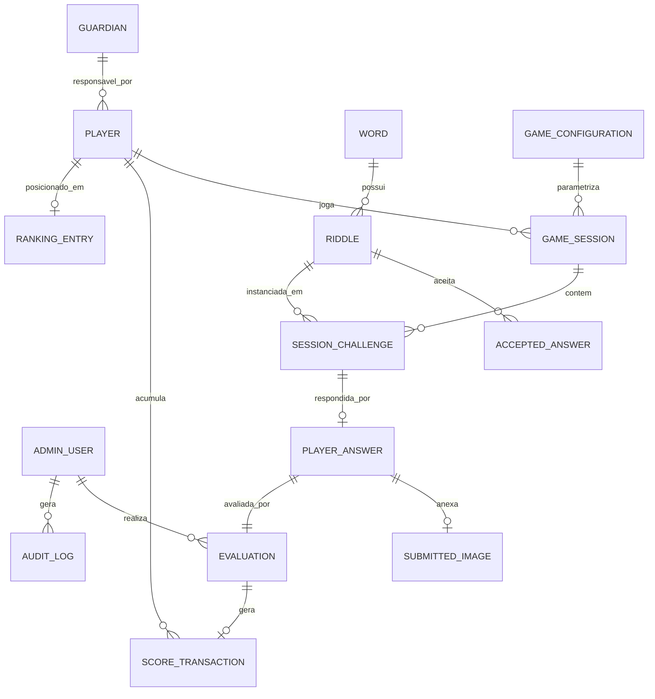

# 05 — Modelo de domínio

> Modelo conceitual. **Os nomes de entidades são propostas, não decisões
> definitivas.** Este documento descreve responsabilidades e relacionamentos; o
> detalhamento de campos está em [modelo de dados inicial](07-modelo-de-dados-inicial.md).

> 📦 Decisões que ainda podem alterar entidades/cardinalidades (identificação,
> responsável/consentimento, expiração, pontuação, desempate, retenção) estão
> analisadas — com **recomendações NÃO APROVADAS** — em
> [13 — Pacote de decisões do MVP](13-pacote-decisoes-mvp.md). Cardinalidades
> definitivas **não** são alteradas aqui com base apenas em recomendações.

## Entidades propostas

| Entidade | Responsabilidade | Status |
| -------- | ---------------- | ------ |
| **Player** | Representa a criança jogadora e sua identidade no jogo. | HIPÓTESE (identificação `PENDENTE`) |
| **Guardian** | Adulto responsável vinculado a um jogador; consentimento. | HIPÓTESE (necessidade `PENDENTE`) |
| **AdminUser** | Usuário do painel administrativo; cadastra conteúdo e avalia. | CONFIRMADO |
| **Word** | Palavra-alvo do acervo. | CONFIRMADO |
| **Riddle** | Charada associada a uma palavra. | CONFIRMADO |
| **AcceptedAnswer** | Texto aceito como correto para uma charada. | CONFIRMADO |
| **GameConfiguration** | Parâmetros da rodada (qtd. de desafios, tempo limite, pontuação). | CONFIRMADO |
| **GameSession** | Uma rodada jogada por um jogador. | CONFIRMADO |
| **SessionChallenge** | Instância de uma charada dentro de uma rodada. | CONFIRMADO |
| **PlayerAnswer** | Resposta textual da criança para um desafio. | CONFIRMADO |
| **SubmittedImage** | Fotografia enviada junto à resposta. | CONFIRMADO |
| **Evaluation** | Decisão humana (aprovar/rejeitar) sobre uma participação. | CONFIRMADO |
| **ScoreTransaction** | Registro rastreável de pontos concedidos. | HIPÓTESE |
| **RankingEntry** | Posição/pontuação agregada de um jogador. | HIPÓTESE (pode ser derivado) |
| **AuditLog** | Registro imutável de ações administrativas. | HIPÓTESE |

## Responsabilidades e relacionamentos

- **Word ↔ Riddle:** uma palavra tem uma ou mais charadas. *(Múltiplas charadas
  por palavra é `HIPÓTESE`.)* Uma charada pertence a uma palavra.
- **Riddle ↔ AcceptedAnswer:** uma charada tem uma ou mais respostas aceitas.
  *(Múltiplas respostas é `PENDENTE`.)*
- **GameConfiguration → GameSession:** a rodada é criada a partir da
  configuração vigente; recomenda-se que a sessão **guarde uma cópia/versão** da
  configuração usada (`HIPÓTESE`) para garantir consistência de pontuação e
  auditoria.
- **GameSession → SessionChallenge:** a rodada agrega N desafios (N =
  quantidade configurada). Cada `SessionChallenge` referencia uma `Riddle`
  sorteada.
- **SessionChallenge → PlayerAnswer:** cada desafio recebe (no máximo) uma
  resposta do jogador.
- **PlayerAnswer → SubmittedImage:** a resposta pode carregar uma imagem.
  *(Obrigatoriedade da imagem é `PENDENTE`.)*
- **PlayerAnswer → Evaluation:** cada participação recebe uma avaliação humana.
- **Evaluation → ScoreTransaction:** avaliação aprovada gera uma transação de
  pontos.
- **ScoreTransaction → RankingEntry:** o ranking agrega as transações válidas
  por jogador. O `RankingEntry` pode ser uma **projeção derivada** em vez de uma
  tabela materializada (`HIPÓTESE`).
- **AdminUser → Evaluation / AuditLog:** o administrador é autor das avaliações
  e das ações auditadas.
- **Player ↔ Guardian:** vínculo opcional para consentimento (`HIPÓTESE`).

## Diagrama de relacionamentos (conceitual)

## Observações de modelagem

- Nomes em inglês foram usados por convenção técnica; o glossário em
  [`AGENTS.md`](../AGENTS.md) mapeia os termos em português.
- Cardinalidades marcadas como opcionais (`o|`, `o{`) refletem estados de
  transição (ex.: resposta ainda sem imagem, participação ainda sem avaliação).
- Decisões que afetam a modelagem (identificação da criança, obrigatoriedade da
  foto, múltiplas respostas/charadas) estão listadas em
  [decisões pendentes](12-decisoes-pendentes.md).

## Referências cruzadas

- [Modelo de dados inicial](07-modelo-de-dados-inicial.md)
- [Regras de negócio](02-regras-de-negocio.md)
- [Fluxos do sistema](04-fluxos-do-sistema.md)
