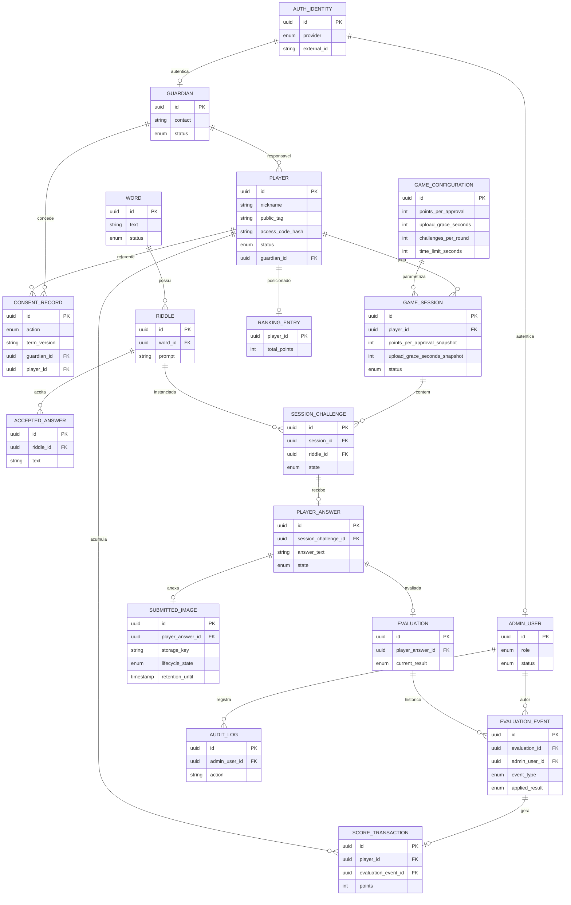

# 07 — Modelo de dados inicial

> Modelo **conceitual**, não físico. **Não** há migrations nem código nesta
> etapa. Os nomes de campos/entidades são **conceituais** (não contratos físicos
> finais). Este documento já reflete as **decisões de produto do MVP** (ver
> [pacote](13-pacote-decisoes-mvp.md)); itens jurídicos (consentimento, retenção,
> faixa etária) permanecem **parciais/pendentes**.

> 🏗️ O **modelo físico Prisma** (schema, migration, constraints, seed e testes)
> está em [14 — Modelo físico Prisma](14-modelo-fisico-prisma.md) e na ADR
> [0002](adr/0002-modelo-fisico-prisma-mvp.md) (`Proposta`).

## Convenções

- Identificadores: chave primária `id` **UUID** (direção de modelagem).
- Datas de auditoria: `created_at`/`updated_at`; `deleted_at` para exclusão
  lógica quando aplicável.
- Estados descritos como **conceituais** — não necessariamente enum físico final.
- Chaves estrangeiras com sufixo `_id`.

## Entidades e campos essenciais

### Player (criança jogadora) — DEC-001
| Campo | Tipo (conceitual) | Notas |
| ----- | ----------------- | ----- |
| id | UUID | PK interna |
| nickname | texto | apelido público; **não** é login; **não** precisa ser único |
| public_tag | texto? | identificador público curto opcional (diferencia apelidos iguais); **nunca** é o código |
| access_code_hash | texto | **hash** do código de acesso (**credencial**); nunca texto puro |
| status | estado | `ativo`/`bloqueado` |
| guardian_id | UUID? | responsável **principal** (opcional até o gate de mídia) |
| created_at / updated_at | timestamp | auditoria |

> **Não coletar:** e-mail/senha da criança, nome completo, documento, **data de
> nascimento**, **idade**, endereço.

### AuthIdentity (contas adultas) — DEC-002 / autenticação
| Campo | Tipo | Notas |
| ----- | ---- | ----- |
| id | UUID | PK |
| provider | enum | `email` (link/código) ou `google` |
| external_id | texto | identificador externo do provedor |
| guardian_id | UUID? | perfil adulto vinculado (responsável) |
| admin_user_id | UUID? | perfil adulto vinculado (administrador) |
| status | estado | `ativa`/`desativada` |
| created_at / updated_at | timestamp | |

> **Sem** token de provedor persistido indevidamente. Identidade externa **não**
> substitui o UUID interno. Campos finais dependem da solução de auth (futura).

### Guardian (responsável) — DEC-002 (⚠️ parcial; jurídico pendente)
| Campo | Tipo | Notas |
| ----- | ---- | ----- |
| id | UUID | PK |
| contact | texto | **meio de contato mínimo** |
| status | estado | `ativa`/`desativada` da conta |
| created_at / updated_at | timestamp | |

> **Sem** `consent_status`: o estado de consentimento **deriva de
> `ConsentRecord`**. Relação **1:N** com crianças (um responsável principal por
> criança no MVP).

### ConsentRecord (consentimento append-only) — DEC-018 (⚠️ parcial; jurídico pendente)
| Campo | Tipo | Notas |
| ----- | ---- | ----- |
| id | UUID | PK |
| action | enum | `concedido` / `revogado` |
| term_version | texto | versão do termo aceito |
| guardian_id | UUID | responsável (ator/origem do consentimento) |
| player_id | UUID | criança/escopo a que se aplica |
| source | texto | origem do fluxo |
| actor | texto | quem registrou |
| created_at | timestamp | **append-only** (nunca alterado/apagado) |

> Estado vigente **derivado do histórico**. Metadados mínimos de auditoria; sem
> cópia desnecessária de dado pessoal.

### AdminUser (administrador)
| Campo | Tipo | Notas |
| ----- | ---- | ----- |
| id | UUID | PK |
| profile | texto | perfil administrativo |
| role | enum | papel/permissão (autorização por papel) |
| status | estado | `ativa`/`desativada` |
| created_at / updated_at | timestamp | |

> Autenticação adulta é feita por **`AuthIdentity`** (e-mail/Google); **não** se
> fixa `password_hash` como solução obrigatória no MVP.

### Word (palavra) — DEC-006
| Campo | Tipo | Notas |
| ----- | ---- | ----- |
| id | UUID | PK |
| text | texto | a palavra-alvo |
| status | estado | `ativa`/`inativa` |
| created_by | UUID | FK → AdminUser |
| created_at / updated_at | timestamp | |

> Uma palavra possui **1..N** charadas (relacional; sem arrays/JSON).

### Riddle (charada) — DEC-005/006
| Campo | Tipo | Notas |
| ----- | ---- | ----- |
| id | UUID | PK |
| word_id | UUID | FK → Word (exatamente uma) |
| prompt | texto | enunciado |
| status | estado | `ativa`/`inativa` |
| created_at / updated_at | timestamp | |

> Uma charada possui **1..N** respostas aceitas (relacional).

### AcceptedAnswer (resposta aceita) — DEC-005
| Campo | Tipo | Notas |
| ----- | ---- | ----- |
| id | UUID | PK |
| riddle_id | UUID | FK → Riddle |
| text | texto | resposta aceita |
| normalized_text | texto | forma normalizada para comparação (`HIPÓTESE`) |
| created_at / updated_at | timestamp | |

### GameConfiguration (configuração) — DEC-003/009
| Campo | Tipo | Notas |
| ----- | ---- | ----- |
| id | UUID | PK |
| points_per_approval | inteiro | pontos por aprovação (padrão 10, configurável) |
| upload_grace_seconds | inteiro | tolerância de upload (padrão 60) |
| challenges_per_round | inteiro | quantidade de desafios |
| time_limit_seconds | inteiro | tempo limite |
| is_current | booleano | configuração vigente |
| created_at / updated_at | timestamp | |

### GameSession (rodada) — snapshots
| Campo | Tipo | Notas |
| ----- | ---- | ----- |
| id | UUID | PK |
| player_id | UUID | FK → Player (jogador identificado) |
| points_per_approval_snapshot | inteiro | cópia na criação |
| upload_grace_seconds_snapshot | inteiro | cópia na criação |
| challenges_count_used | inteiro | quantidade usada |
| time_limit_seconds_used | inteiro | tempo limite usado |
| status | estado | `criada`/`em_andamento`/`concluida`/`expirada`/`cancelada` |
| started_at / expires_at / ended_at | timestamp | servidor é autoridade do tempo |
| created_at / updated_at | timestamp | |

### SessionChallenge (desafio da sessão)
| Campo | Tipo | Notas |
| ----- | ---- | ----- |
| id | UUID | PK |
| session_id | UUID | FK → GameSession |
| riddle_id | UUID | FK → Riddle (sorteada) |
| position | inteiro | ordem na rodada |
| state | estado (conceitual) | `pendente`/`ativo`/`completo`/`enviado`/`pulado`/`expirado_incompleto` |
| created_at / updated_at | timestamp | |

### PlayerAnswer (resposta do jogador)
| Campo | Tipo | Notas |
| ----- | ---- | ----- |
| id | UUID | PK |
| session_challenge_id | UUID | FK → SessionChallenge |
| answer_text | texto | guardado **mesmo quando incorreto** |
| state | estado (conceitual) | `rascunho`/`completa`/`enviada`/`preservada_apos_expiracao`/`em_avaliacao` |
| submitted_at | timestamp? | momento do envio |
| created_at / updated_at | timestamp | |

### SubmittedImage (imagem enviada) — DEC-009/010
| Campo | Tipo | Notas |
| ----- | ---- | ----- |
| id | UUID | PK |
| player_answer_id | UUID | FK → PlayerAnswer |
| storage_key | texto | referência privada (**nunca** URL pública) |
| content_type / size_bytes | texto / inteiro | validados |
| lifecycle_state | estado (conceitual) | `reservada`/`em_upload`/`confirmada`/`associada`/`expirada_orfa`/`excluida` |
| exif_stripped | booleano | metadados sensíveis removidos (`HIPÓTESE`) |
| retention_until | timestamp? | prazo `DEPENDE DE REVISÃO JURÍDICA` |
| deletion_state / deleted_at / deletion_reason | estado / timestamp? / texto? | expurgo |
| object_deletion_confirmed | booleano | confirmação de exclusão do objeto |
| purge_attempts / purge_last_error | inteiro / texto? | tentativas e falhas de expurgo |
| created_at / updated_at | timestamp | |

### Evaluation (avaliação — agregado)
| Campo | Tipo | Notas |
| ----- | ---- | ----- |
| id | UUID | PK |
| player_answer_id | UUID | FK → PlayerAnswer (no máx. uma por participação) |
| current_result | estado | `pendente`/`aprovada`/`rejeitada` |
| updated_at | timestamp | |

> `current_result = pendente` é possível **quando não existem eventos** (avaliação
> recém-criada, ainda sem decisão administrativa). Após a **primeira decisão**, o
> estado atual **deriva do histórico de eventos** (não se cria um evento
> artificial de "pendente").

### EvaluationEvent (evento de avaliação — append-only)
| Campo | Tipo | Notas |
| ----- | ---- | ----- |
| id | UUID | PK |
| evaluation_id | UUID | FK → Evaluation |
| applied_result | enum | resultado aplicado (aprovada/rejeitada) |
| admin_user_id | UUID | autor administrativo |
| event_type | enum | `decisao_inicial`/`revisao`/`correcao` |
| reason | texto? | motivo/observação |
| previous_event_id | UUID? | referência ao evento anterior, quando aplicável |
| created_at | timestamp | **append-only** (nunca sobrescrito/apagado) |

### ScoreTransaction (transação de pontos)
| Campo | Tipo | Notas |
| ----- | ---- | ----- |
| id | UUID | PK |
| player_id | UUID | FK → Player |
| evaluation_event_id | UUID | FK → EvaluationEvent — **chave de idempotência** (no máx. 1 por evento) |
| points | inteiro | **positivo ou negativo** (compensatório) |
| created_at | timestamp | **nunca** sobrescrito/excluído |

### RankingEntry (ranking) — **projeção derivada** (ranking denso)
| Campo | Tipo | Notas |
| ----- | ---- | ----- |
| player_id | UUID | FK → Player |
| total_points | inteiro | soma das transações (positivas + compensatórias) |
| updated_at | timestamp | |

> **Sem campo `tiebreaker`** (DEC-004): empatados **compartilham posição**; a
> ordenação técnica para paginação usa o **UUID interno** sem alterar a posição
> competitiva.

### AuditLog (auditoria)
| Campo | Tipo | Notas |
| ----- | ---- | ----- |
| id | UUID | PK |
| admin_user_id | UUID | autor |
| action | texto | ação realizada |
| target_type / target_id | texto / UUID | alvo |
| created_at | timestamp | imutável |

> Logs **não** armazenam conteúdo da fotografia.

## Diagrama ER (conceitual)

## Cardinalidades (resumo)

- **Word 1:N Riddle** · **Riddle 1:N AcceptedAnswer**
- **Guardian 1:N Player** (um responsável principal por criança no MVP)
- **AuthIdentity 0..1** Guardian / **0..1** AdminUser
- **Player 1:N GameSession**
- **GameConfiguration 1:N GameSession** (com snapshot na rodada)
- **GameSession 1:N SessionChallenge**
- **SessionChallenge 0..1 PlayerAnswer**
- **PlayerAnswer 0..1 SubmittedImage** durante o fluxo — mas **uma resposta
  enviada exige exatamente uma imagem válida** (foto obrigatória)
- **PlayerAnswer 0..1 Evaluation**
- **Evaluation 0:N EvaluationEvent** (pendente sem evento até a 1ª decisão)
- **EvaluationEvent 0..1 ScoreTransaction** (idempotência por evento)
- **Player 1:N ScoreTransaction**

## Estratégias

- **Imagens:** objeto privado; o banco guarda `storage_key` + metadados; acesso
  autorizado; sem URL pública. Ciclo de vida e retenção conforme campos acima —
  **prazo de retenção `DEPENDE DE REVISÃO JURÍDICA`** (bloqueia lançamento com
  fotos).
- **Avaliação append-only:** `Evaluation` é o agregado; cada decisão/revisão é um
  `EvaluationEvent` imutável; o estado atual deriva do histórico.
- **Pontuação:** cada efeito é uma `ScoreTransaction` referenciando um
  `EvaluationEvent` (idempotência por evento). Aprovação inicial `+`, reversão
  `-`, nova aprovação `+`; **rejeição inicial não gera transação**. Transações
  nunca são alteradas/excluídas; o ranking (denso) deriva da soma.
- **Consentimento:** derivado de `ConsentRecord` (append-only); **não** há campo
  de estado em `Guardian`.

## Referências cruzadas

- [Modelo de domínio](05-modelo-de-dominio.md)
- [Regras de negócio](02-regras-de-negocio.md)
- [Pacote de decisões do MVP](13-pacote-decisoes-mvp.md)
- [Segurança e privacidade](08-seguranca-e-privacidade.md)
