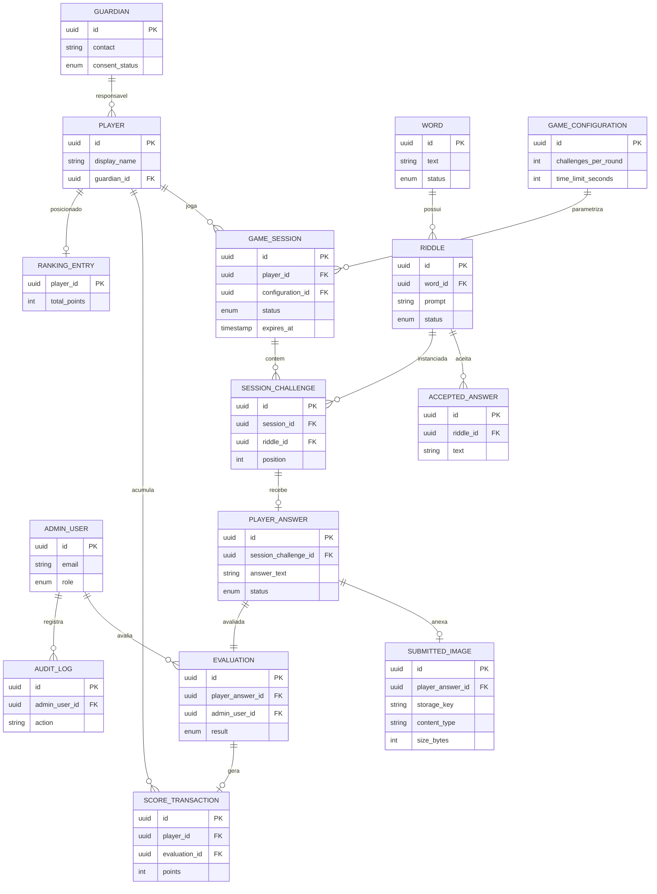

# 07 — Modelo de dados inicial

> Modelo **conceitual**, não físico. **Não** há migrations nem código nesta
> etapa. Nomes de tabelas/campos são propostas. Decisões que impactam o modelo
> estão em [decisões pendentes](12-decisoes-pendentes.md).

## Convenções propostas

- Identificadores: chave primária `id` (UUID como `HIPÓTESE`).
- Datas de auditoria: `created_at`, `updated_at` em todas as entidades; e
  `deleted_at` para exclusão lógica quando aplicável (`HIPÓTESE`).
- Enumerações de status como campos `status` com valores definidos por entidade.
- Chaves estrangeiras com sufixo `_id`.

## Entidades e campos essenciais

### Player (jogador)
| Campo | Tipo (conceitual) | Notas |
| ----- | ----------------- | ----- |
| id | UUID | PK |
| display_name | texto | apelido não sensível; identificação real `PENDENTE` |
| guardian_id | UUID? | FK opcional → Guardian (`HIPÓTESE`) |
| created_at / updated_at | timestamp | auditoria |

### Guardian (responsável) — `HIPÓTESE`
| Campo | Tipo | Notas |
| ----- | ---- | ----- |
| id | UUID | PK |
| contact | texto | dado sensível; minimizar; ver [segurança](08-seguranca-e-privacidade.md) |
| consent_status | enum | `pendente`/`concedido`/`revogado` (`HIPÓTESE`) |
| created_at / updated_at | timestamp | |

### AdminUser (administrador)
| Campo | Tipo | Notas |
| ----- | ---- | ----- |
| id | UUID | PK |
| email | texto | login |
| role | enum | papel/permissão |
| password_hash | texto | **nunca** em texto plano; solução de auth `PENDENTE` |
| created_at / updated_at | timestamp | |

### Word (palavra)
| Campo | Tipo | Notas |
| ----- | ---- | ----- |
| id | UUID | PK |
| text | texto | a palavra-alvo |
| status | enum | `ativa`/`inativa` (`HIPÓTESE`) |
| created_by | UUID | FK → AdminUser |
| created_at / updated_at | timestamp | |

### Riddle (charada)
| Campo | Tipo | Notas |
| ----- | ---- | ----- |
| id | UUID | PK |
| word_id | UUID | FK → Word |
| prompt | texto | enunciado da charada |
| status | enum | `ativa`/`inativa` (`HIPÓTESE`) |
| created_at / updated_at | timestamp | |

### AcceptedAnswer (resposta aceita)
| Campo | Tipo | Notas |
| ----- | ---- | ----- |
| id | UUID | PK |
| riddle_id | UUID | FK → Riddle |
| text | texto | resposta aceita |
| normalized_text | texto | forma normalizada para comparação (`HIPÓTESE`) |
| created_at / updated_at | timestamp | |

### GameConfiguration (configuração)
| Campo | Tipo | Notas |
| ----- | ---- | ----- |
| id | UUID | PK |
| challenges_per_round | inteiro | quantidade de desafios |
| time_limit_seconds | inteiro | tempo limite da sessão |
| scoring_rule | json/texto | regra de pontuação (`PENDENTE`) |
| is_current | booleano | configuração vigente (`HIPÓTESE`) |
| created_at / updated_at | timestamp | |

### GameSession (rodada)
| Campo | Tipo | Notas |
| ----- | ---- | ----- |
| id | UUID | PK |
| player_id | UUID | FK → Player |
| configuration_id | UUID | FK → GameConfiguration (versão usada) |
| status | enum | `criada`/`em_andamento`/`concluida`/`expirada`/`cancelada` |
| started_at | timestamp | início efetivo |
| expires_at | timestamp | início + tempo limite (`HIPÓTESE`) |
| ended_at | timestamp? | fim efetivo |
| created_at / updated_at | timestamp | |

### SessionChallenge (desafio da sessão)
| Campo | Tipo | Notas |
| ----- | ---- | ----- |
| id | UUID | PK |
| session_id | UUID | FK → GameSession |
| riddle_id | UUID | FK → Riddle (sorteada) |
| position | inteiro | ordem na rodada |
| created_at / updated_at | timestamp | |

### PlayerAnswer (resposta do jogador)
| Campo | Tipo | Notas |
| ----- | ---- | ----- |
| id | UUID | PK |
| session_challenge_id | UUID | FK → SessionChallenge (1:1) |
| answer_text | texto | resposta digitada |
| status | enum | `rascunho`/`enviada`/`em_avaliacao` |
| submitted_at | timestamp? | momento do envio |
| created_at / updated_at | timestamp | |

### SubmittedImage (imagem enviada)
| Campo | Tipo | Notas |
| ----- | ---- | ----- |
| id | UUID | PK |
| player_answer_id | UUID | FK → PlayerAnswer |
| storage_key | texto | referência no armazenamento de objetos (**não** URL pública) |
| content_type | texto | tipo validado |
| size_bytes | inteiro | tamanho validado |
| exif_stripped | booleano | metadados removidos (`HIPÓTESE`) |
| created_at / updated_at | timestamp | |

### Evaluation (avaliação)
| Campo | Tipo | Notas |
| ----- | ---- | ----- |
| id | UUID | PK |
| player_answer_id | UUID | FK → PlayerAnswer (1:1) |
| admin_user_id | UUID | FK → AdminUser (quem avaliou) |
| result | enum | `pendente`/`aprovada`/`rejeitada`/`em_revisao` |
| reason | texto? | motivo (ao rejeitar) — `HIPÓTESE` |
| decided_at | timestamp? | momento da decisão |
| created_at / updated_at | timestamp | |

### ScoreTransaction (transação de pontos) — `HIPÓTESE`
| Campo | Tipo | Notas |
| ----- | ---- | ----- |
| id | UUID | PK |
| player_id | UUID | FK → Player |
| evaluation_id | UUID | FK → Evaluation (rastreabilidade) |
| points | inteiro | pontos concedidos |
| created_at | timestamp | |

### RankingEntry (ranking) — `HIPÓTESE` (pode ser projeção derivada)
| Campo | Tipo | Notas |
| ----- | ---- | ----- |
| player_id | UUID | FK → Player |
| total_points | inteiro | soma das transações válidas |
| tiebreaker | texto/valor | critério de desempate (`PENDENTE`) |
| updated_at | timestamp | |

### AuditLog (auditoria) — `HIPÓTESE`
| Campo | Tipo | Notas |
| ----- | ---- | ----- |
| id | UUID | PK |
| admin_user_id | UUID | autor |
| action | texto | ação realizada |
| target_type / target_id | texto / UUID | alvo |
| created_at | timestamp | imutável |

## Diagrama ER (conceitual)

## Cardinalidades (resumo)

- Word `1..N` Riddle · Riddle `1..N` AcceptedAnswer
- GameConfiguration `1..N` GameSession
- GameSession `1..N` SessionChallenge
- SessionChallenge `1..1` PlayerAnswer (0..1 enquanto não respondida)
- PlayerAnswer `0..1` SubmittedImage · PlayerAnswer `1..1` Evaluation
- Evaluation `0..1` ScoreTransaction (só quando aprovada)
- Player `1..N` ScoreTransaction · Player `0..1` RankingEntry

## Estratégias

- **Imagens:** arquivos em armazenamento de objetos privado; o banco guarda
  apenas `storage_key` e metadados. Acesso via URL assinada/autorizada. Sem URLs
  públicas. Ver [segurança](08-seguranca-e-privacidade.md).
- **Pontuação:** modelada como **transações** (`ScoreTransaction`) para
  rastreabilidade e reprocessamento; o total do ranking deriva das transações
  válidas.
- **Rastreabilidade da avaliação:** `ScoreTransaction` referencia a `Evaluation`
  que a originou; `AuditLog` registra ações administrativas.

## Referências cruzadas

- [Modelo de domínio](05-modelo-de-dominio.md)
- [Opções de arquitetura](06-opcoes-de-arquitetura.md)
- [Segurança e privacidade](08-seguranca-e-privacidade.md)
