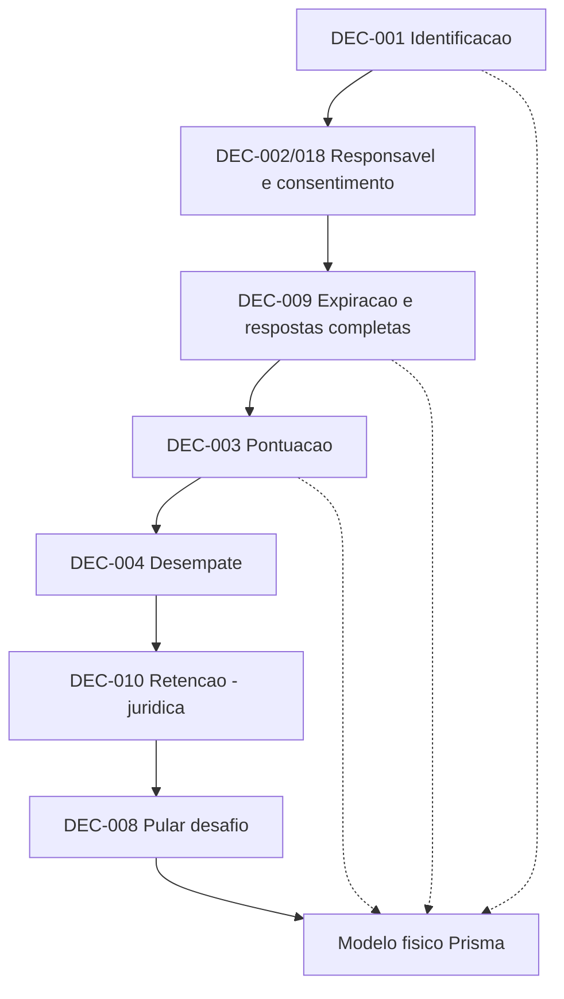

# 13 — Pacote de decisões do MVP

> ⚠️ **Este documento não aprova nada.** Ele reúne **opções**, **trade-offs** e
> **recomendações NÃO APROVADAS** para que o orquestrador decida. Nenhuma
> recomendação aqui é `CONFIRMADO`/`RESOLVIDO`. Marcações usadas:
> `OPÇÃO`, `HIPÓTESE`, `RECOMENDAÇÃO NÃO APROVADA`,
> `DEPENDE DE DECISÃO DO ORQUESTRADOR`, `DEPENDE DE REVISÃO JURÍDICA`.

## Finalidade

Destravar o **modelo físico de dados** e o início das funcionalidades do jogador,
oferecendo ao orquestrador um conjunto de decisões conscientes sobre regras de
produto e domínio do MVP.

## Escopo

Cobre as decisões: identificação da criança (DEC-001), responsável (DEC-002) e
consentimento (DEC-018), pontuação (DEC-003), desempate (DEC-004), expiração
(DEC-009), retenção de fotografias (DEC-010) e pular desafio (DEC-008). Trata,
em seção separada e **sem resolver**, decisões relacionadas não bloqueantes
agora (DEC-005, DEC-006, DEC-016, DEC-017, DEC-014, DEC-015).

## Fontes analisadas

[README](../README.md) · [AGENTS](../AGENTS.md) ·
[00 Visão](00-visao-do-produto.md) · [01 Requisitos](01-escopo-e-requisitos.md) ·
[02 Regras](02-regras-de-negocio.md) · [03 Personas](03-personas-e-jornadas.md) ·
[04 Fluxos](04-fluxos-do-sistema.md) · [05 Domínio](05-modelo-de-dominio.md) ·
[07 Dados](07-modelo-de-dados-inicial.md) ·
[08 Segurança/Privacidade](08-seguranca-e-privacidade.md) ·
[09 Mobile](09-experiencia-mobile.md) · [10 Testes](10-estrategia-de-testes.md) ·
[11 Backlog](11-backlog-inicial.md) · [12 Decisões pendentes](12-decisoes-pendentes.md) ·
[ADR 0001](adr/0001-arquitetura-web-integrada.md).

## Diferença entre recomendação e decisão

- **Recomendação** = sugestão técnica/de produto deste agente, sempre marcada
  `RECOMENDAÇÃO NÃO APROVADA`. Não altera regras nem código.
- **Decisão** = escolha explícita do orquestrador (produto) ou do jurídico
  (conformidade). Só então uma regra vira `CONFIRMADO` e/ou uma ADR é criada.

## Aviso de revisão jurídica

Itens de **consentimento**, **faixa etária legal**, **base legal**, **prazo
obrigatório de retenção** e **validade de fluxo** são
`DEPENDE DE REVISÃO JURÍDICA` e **não** são decididos aqui (ver
[08](08-seguranca-e-privacidade.md), §12).

## Decisões necessárias para destravar o modelo físico

Bloqueantes diretas do modelo físico: **DEC-001** (Player), **DEC-002/DEC-018**
(Guardian/ConsentRecord), **DEC-009** (estados de sessão/resposta), **DEC-003**
(ScoreTransaction) e **DEC-004** (ranking). **DEC-010** e **DEC-008** ajustam
campos/estados mas não impedem começar as entidades centrais.

---

## Restrições confirmadas pelo briefing (base imutável)

Tratadas como `CONFIRMADO` (origem: briefing), servem de piso para todas as opções:

1. A resposta digitada é **armazenada mesmo quando incorreta**.
2. A **fotografia é obrigatória** para envio na 1ª versão (ver
   [RN-FOT-003](02-regras-de-negocio.md)); futura opção facultativa **não** está
   aprovada.
3. A fotografia **não** é reconhecida automaticamente na 1ª versão.
4. A **avaliação final é humana**.
5. A **pontuação permanece pendente** até validação administrativa.
6. **Somente pontos validados** entram no ranking.
7. Uma resposta **não pode ser pontuada duas vezes** (idempotência).
8. O **fim do tempo preserva o que já foi salvo**.
9. Alterações de avaliação são **auditáveis**.
10. **Minimização** de dados pessoais.
11. Imagens **privadas**; **não** exibidas a outros jogadores.
12. **Nenhum dado pessoal real** em testes.
13. Regras não confirmadas permanecem **hipóteses**.

> Um **rascunho** de resposta pode existir sem imagem, mas **não pode ser
> enviado** para avaliação sem uma fotografia válida (reconciliação de DEC-007).

---

## DEC-001 — Como a criança será identificada no MVP?

### Problema
Toda rodada, resposta e pontuação precisa pertencer a um jogador estável. A
forma de identificação define a entidade `Player`, a coleta de dados pessoais, a
recuperação de acesso e a exibição no ranking — e condiciona `Guardian`/consentimento.

### Restrições já confirmadas
Minimização de dados (10); imagens privadas (11); nenhum dado real em teste (12);
avaliação/ranking dependem de jogador identificável (4–6).

### Opções
- **OPÇÃO A — Apelido + sessão local:** sem cadastro; identidade presa ao
  dispositivo/navegador; recuperação fraca; risco de apelidos duplicados.
- **OPÇÃO B — Apelido + código gerado:** o sistema gera um identificador/código
  de acesso; sem e-mail da criança; permite retomar em outro dispositivo; exige
  cuidado com código perdido/compartilhado.
- **OPÇÃO C — Jogador vinculado à conta do responsável:** responsável autentica
  e seleciona a criança; maior controle e recuperação; mais fricção e mais dados.
- **OPÇÃO D — Conta própria da criança:** **alto risco** de privacidade e
  usabilidade infantil; não recomendada sem justificativa extraordinária.

Em todas: usar **identificador interno** (UUID) distinto do **nome público**
(apelido); apelido único por escopo (global ou por responsável); política de
troca de apelido; filtro de nomes ofensivos; bloqueio/exclusão.

### Matriz comparativa
| Dimensão | A (local) | B (código) | C (via responsável) | D (conta própria) |
| --- | --- | --- | --- | --- |
| Facilidade para a criança | Alta | Alta | Média | Baixa |
| Privacidade | Alta | Alta | Média | Baixa |
| Recuperação de acesso | Muito baixa | Média | Alta | Média |
| Complexidade técnica | Baixa | Média | Alta | Alta |
| Impacto operacional | Baixo | Médio | Alto | Alto |
| Impacto no modelo de dados | Mínimo (`Player` só apelido) | `Player`+código | `Player`+`Guardian` | `Player`+auth |
| Risco de abuso | Médio (apelidos) | Médio (código vazado) | Baixo | Alto |
| Dependência jurídica | Baixa | Baixa–Média | Média–Alta | Alta |

### Recomendação para o MVP — `RECOMENDAÇÃO NÃO APROVADA`
**Opção B (apelido + código gerado)**, com identificador interno UUID.
- **Justificativa:** equilibra privacidade (sem e-mail da criança), permite
  retomada e mantém a coleta mínima; combina bem com consentimento por evento
  (ver DEC-002/018 Opção C).
- **Vantagens:** simples para a criança; recuperação razoável via código;
  domínio enxuto.
- **Limitações:** código perdido = acesso perdido (mitigável se o responsável o
  guardar); código compartilhado permite personificação.
- **Riscos:** apelidos ofensivos (mitigar com filtro + moderação humana);
  colisão de apelidos (resolver por unicidade + sufixo ou escopo por responsável).
- **Condições necessárias:** política de geração/armazenamento seguro do código
  (não é segredo forte, mas não deve vazar em logs/URL); regra de unicidade.
- **Versão futura:** vínculo opcional com responsável (migrar B→C) para
  recuperação forte.

### Consequências de não decidir
Bloqueia `Player` e, por consequência, `GameSession`, `PlayerAnswer`,
`ScoreTransaction` e ranking — ou seja, o modelo físico inteiro do jogador.

### Pergunta para o orquestrador
Ver formulário, item 1.

---

## DEC-002 — Vínculo/cadastro do responsável · DEC-018 — Consentimento

> Analisadas em conjunto (compartilham fluxo), mantendo códigos distintos.
> Vários pontos abaixo são `DEPENDE DE REVISÃO JURÍDICA`.

### Problema
Por envolver **crianças** e **fotografias**, é provável a necessidade de
consentimento do responsável (LGPD). É preciso decidir **se/quando** um
responsável é exigido e **como** o consentimento é registrado, revogado e
auditado — sem redigir o termo jurídico.

### Restrições já confirmadas
Minimização (10); imagens privadas e não exibidas (11); avaliação humana (4);
nenhum dado real em teste (12).

### Opções
- **OPÇÃO A — Responsável obrigatório antes de iniciar:** máximo controle;
  máxima fricção; coleta dados antes de qualquer uso.
- **OPÇÃO B — Jogo inicia sem dados; responsável obrigatório antes da 1ª
  fotografia:** posterga a coleta ao ponto de maior sensibilidade (imagem);
  alinha minimização com proteção.
- **OPÇÃO C — Consentimento por evento/código, sem conta persistente:** um
  registro de consentimento (versão, data, origem) vinculado ao evento, sem
  cadastro completo do responsável.
- **OPÇÃO D — Sem responsável cadastrado:** **alto risco** jurídico e de
  proteção; não é solução automaticamente aceitável.

Analisar: dados mínimos do responsável; meio de contato (e-mail/outro);
verificação; **versão do termo aceito**; **data e origem** do consentimento;
revogação; bloqueio após revogação; exclusão; N crianças por responsável; N
responsáveis por criança; acesso administrativo; auditoria.

### Matriz comparativa
| Dimensão | A (obrig. início) | B (antes da foto) | C (por evento) | D (sem responsável) |
| --- | --- | --- | --- | --- |
| UX infantil | Baixa (fricção cedo) | Alta | Alta | Alta |
| Privacidade / minimização | Média (coleta cedo) | Alta | Alta | Alta na coleta / baixa na proteção |
| Segurança / proteção do menor | Alta | Alta | Média–Alta | Baixa |
| Domínio | `Guardian`+`ConsentRecord` | idem, criado tardiamente | `ConsentRecord` (Guardian opcional) | nenhum |
| Persistência | Guardian persistente | Guardian persistente | Consentimento sem conta | — |
| API | fluxo de auth do responsável | gate antes do upload | endpoint de consentimento | — |
| Operação admin | gestão de responsáveis | idem | gestão de consentimentos | — |
| Testes | fixtures de responsável (fictícios) | idem | fixtures de consentimento | — |
| Dependência jurídica | **Alta** | **Alta** | **Alta** | **Muito alta** |

### Recomendação para o MVP — `RECOMENDAÇÃO NÃO APROVADA`
**Opção B** (jogo inicia sem dados; **consentimento do responsável exigido antes
da primeira fotografia**), materializando o consentimento como **`ConsentRecord`**
(versão do termo, data, origem) e um **`Guardian`** mínimo (apenas meio de
contato), **condicionado a revisão jurídica**.
- **Justificativa:** a foto é o dado mais sensível e é obrigatória para envio;
  exigir consentimento exatamente nesse ponto concilia minimização e proteção.
- **Vantagens:** baixa fricção inicial; coleta só quando necessário; trilha de
  auditoria de consentimento.
- **Limitações/Riscos:** verificação real de "responsável" é limitada
  tecnicamente (`DEPENDE DE REVISÃO JURÍDICA`); revogação exige bloquear novos
  envios e tratar imagens já enviadas (liga-se a DEC-010).
- **Condições necessárias:** texto do termo, base legal e idade — **jurídico**.
- **Versão futura:** verificação reforçada do responsável; portal do responsável.

### Consequências de não decidir
Bloqueia `Guardian`/`ConsentRecord` e o **gate de upload**; sem isso, o fluxo de
fotografia (obrigatório) não pode ser liberado com segurança.

### Pergunta para o orquestrador
Ver formulário, itens 2 e 3.

---

## DEC-003 — Fórmula de pontuação

### Problema
Define `ScoreTransaction` e o ranking. Deve ser justa apesar de **conexão lenta**
e **upload**, previsível para crianças e **determinística/auditável**.

### Restrições já confirmadas
Pontuação pendente até validação (5); só validados no ranking (6); sem pontuação
dupla/idempotência (7); auditável (9); avaliação humana (4).

### Opções
- **OPÇÃO A — Pontos fixos por resposta aprovada** (ex.: 10/resposta).
- **OPÇÃO B — Fixos + bônus por tempo** (quanto mais rápido, mais bônus).
- **OPÇÃO C — Pontos por dificuldade da charada** (nível atribuído pelo admin).
- **OPÇÃO D — Combinação acerto + tempo + dificuldade.**

### Matriz comparativa
| Dimensão | A (fixo) | B (tempo) | C (dificuldade) | D (combinado) |
| --- | --- | --- | --- | --- |
| Simplicidade p/ criança | Alta | Média | Média | Baixa |
| Transparência | Alta | Média | Média | Baixa |
| Justiça sob conexão lenta | **Alta** | **Baixa** (pune upload lento) | Alta | Baixa |
| Incentivo a resposta apressada | Nenhum | **Alto** | Nenhum | Alto |
| Depende de config histórica | Não | Sim (janela) | Sim (nível) | Sim |
| Determinismo/auditoria | Alta | Média | Alta | Média |
| Impacto no modelo de dados | Mínimo | +tempos | +nível na charada | +vários |
| Risco de injustiça | Baixo | **Alto** | Médio | Alto |

### Recomendação para o MVP — `RECOMENDAÇÃO NÃO APROVADA`
**Opção A (pontos fixos por resposta aprovada)**.
- **Justificativa:** previsível, transparente e **imune a penalizar conexão/
  upload lentos**; determinística e trivialmente auditável.
- **Vantagens:** modelo de dados mínimo; fácil de explicar à criança.
- **Limitações:** menos "gamificação" (aceitável no MVP).
- **Riscos:** baixos.
- **Condições:** definir unidade e valor como **HIPÓTESE** (ex.: 10 pontos),
  não aprovados aqui.
- **Versão futura:** dificuldade (C) quando houver níveis curados; evitar bônus
  por tempo enquanto o upload for gargalo.

**Hipóteses a confirmar:** unidade de pontos; **momento da concessão** (na
aprovação); **reversão/ajuste** após reavaliação (estorno via nova transação,
preservando histórico); **resposta rejeitada = 0**; **idempotência** (uma
`ScoreTransaction` por `Evaluation` aprovada). Valores finais **não** aprovados.

### Consequências de não decidir
Bloqueia `ScoreTransaction`, o cálculo e o ranking.

### Pergunta para o orquestrador
Ver formulário, item 4.

---

## DEC-004 — Critério de desempate no ranking

### Problema
Com pontos fixos, empates são comuns. É preciso uma **cadeia determinística** de
critérios estável para paginação, robusta a datas de início diferentes,
conexão lenta e reavaliações fora de ordem.

### Restrições já confirmadas
Só pontos validados (6); auditável (9); idempotência (7).

### Opções (dimensões de desempate)
Maior nº de desafios aprovados · menor tempo de rodada · menor nº de rejeições ·
primeiro a atingir a pontuação · **data da última pontuação validada** · apelido/
identificador (apenas último critério técnico).

### Matriz comparativa (critério isolado)
| Critério | Justiça | Determinismo | Robusto a conexão lenta | Estável p/ paginação |
| --- | --- | --- | --- | --- |
| Desafios aprovados | Alta | Alta | Alta | Média |
| Menor tempo de rodada | Média | Média | **Baixa** | Média |
| Menos rejeições | Média | Alta | Alta | Média |
| Primeiro a atingir | Média | Média | Média | Média |
| Data da última validação | Média | Alta | Alta | Alta |
| Apelido/UUID | — (arbitrário) | **Alta** | Alta | **Alta** |

### Recomendação para o MVP — `RECOMENDAÇÃO NÃO APROVADA`
**Cadeia:** (1) maior pontuação validada → (2) maior nº de respostas aprovadas →
(3) menor nº de rejeições → (4) **data/hora da última pontuação validada** (mais
cedo ganha) → (5) **UUID interno** (desempate técnico final, determinístico).
- **Justificativa:** evita usar "tempo de rodada" (penaliza conexão lenta);
  termina em critério 100% determinístico, garantindo ordenação/paginação estável.
- **Limitações:** o critério (4) favorece quem jogou/foi avaliado antes —
  aceitável e transparente.
- **Riscos:** reavaliações fora de ordem alteram (4); auditar mudanças (9).

### Consequências de não decidir
Ranking sem ordenação estável; paginação inconsistente; testes de ranking sem
oráculo.

### Pergunta para o orquestrador
Ver formulário, item 5.

---

## DEC-009 — Comportamento ao expirar a rodada

> Regra confirmada e inegociável: **o fim do tempo preserva o que já foi salvo**.
> O destino de respostas completas/incompletas/não enviadas permanece
> `PENDENTE` até esta decisão.

### Problema
Definir, de forma previsível e idempotente, o que acontece a cada estado no
instante da expiração, considerando relógio cliente×servidor, upload em curso e
reconexão.

### Restrições já confirmadas
Preservar o que foi salvo (8); resposta salva mesmo incorreta (1); foto
obrigatória para envio (2); idempotência (7); avaliação humana (4).

### Definição de "resposta completa" (1ª versão)
Texto salvo **e** fotografia válida salva **e** desafio ainda não enviado/avaliado.

### Opções
- **OPÇÃO A — Encerrar e enviar automaticamente apenas as completas.**
- **OPÇÃO B — Encerrar e manter tudo como rascunho para envio posterior.**
- **OPÇÃO C — Encerrar, enviar completas e manter incompletas como histórico não
  avaliável.**
- **OPÇÃO D — Encerrar sem envio automático, preservando o estado para o
  administrador.**

### Matriz comparativa
| Dimensão | A | B | C | D |
| --- | --- | --- | --- | --- |
| Previsibilidade p/ criança | Alta | Média | Alta | Média |
| Respeita "preserva salvo" | Sim | Sim | Sim | Sim |
| Retomada após limite | Não | **Sim** | Não | Depende |
| Complexidade | Média | Alta | Média | Baixa |
| Concorrência/idempotência | Média | Alta | Média | Baixa |
| Carga de avaliação | Só completas | Variável | Só completas | Manual |

### Recomendação para o MVP — `RECOMENDAÇÃO NÃO APROVADA`
**Opção A** (encerra e **envia automaticamente apenas as completas**; incompletas
ficam preservadas como rascunho **não** avaliável, sem retomada no MVP).
Comportamento por estado no instante da expiração:
- **Resposta completa (texto+imagem, não enviada):** enviada automaticamente →
  entra na fila de avaliação (idempotente: no máximo uma submissão).
- **Texto sem imagem:** **não** é enviável (viola foto obrigatória); preservado
  como rascunho; não avaliável.
- **Imagem em upload:** se o upload **confirmar no servidor** dentro de uma
  janela de tolerância curta, conta como completa; senão, permanece rascunho.
- **Desafio ainda não aberto:** permanece não iniciado (sem penalidade além de
  não pontuar).
- **Requisição enviada antes do limite e recebida depois:** decidir pelo
  **carimbo do servidor** no aceite; aceitar submissões cuja gravação server-side
  ocorra dentro da janela de tolerância; caso contrário, tratar como rascunho.
- **Reconexão após o limite:** rodada aparece **encerrada**; sem novos envios;
  estado visível como somente leitura.
- **Comunicação à criança:** mensagem gentil de "tempo esgotado; enviamos o que
  estava pronto".

**Hipóteses:** duração da janela de tolerância; autoridade do relógio (servidor);
se há retomada (no MVP, **não**).

### Consequências de não decidir
Bloqueia os **estados** de `GameSession` e `PlayerAnswer` (logo o enum de status
no modelo físico) e os testes de expiração/idempotência.

### Pergunta para o orquestrador
Ver formulário, item 6.

---

## DEC-010 — Retenção das fotografias

> `DEPENDE DE REVISÃO JURÍDICA`. Prazos abaixo são **exemplos de análise**, não
> determinação legal.

### Problema
Equilibrar contestação/revisão de avaliação, custo, minimização e direitos do
titular, definindo quando a imagem é excluída (banco **e** objeto).

### Restrições já confirmadas
Imagens privadas, não exibidas (11); minimização (10); avaliação humana (4);
auditável (9).

### Opções
Excluir pouco após a avaliação · prazo fixo após a avaliação (ex.: 30–90 dias) ·
prazo fixo após o fim da rodada · reter enquanto houver possibilidade de revisão ·
exclusão manual mediante solicitação.

### Matriz comparativa
| Dimensão | Pós-avaliação | Prazo pós-avaliação | Prazo pós-rodada | Enquanto revisável | Manual |
| --- | --- | --- | --- | --- | --- |
| Minimização | **Alta** | Média | Média | Baixa | Baixa |
| Permite revisão/contestação | Baixa | Média | Média | **Alta** | Variável |
| Custo de storage | Baixo | Médio | Médio | Alto | Alto |
| Complexidade | Baixa | Média | Média | Alta | Média |
| Dependência jurídica | **Alta** | **Alta** | **Alta** | **Alta** | **Alta** |

### Recomendação para o MVP — `RECOMENDAÇÃO NÃO APROVADA` · `DEPENDE DE REVISÃO JURÍDICA`
**Prazo fixo curto após a avaliação** (ex.: **30 dias**, como HIPÓTESE), com
exclusão do **objeto** e do registro, mantendo apenas **metadados de auditoria
sem a imagem** (quem avaliou, quando, resultado).
- **Justificativa:** cobre janela de revisão sem reter imagens indefinidamente.
- **Limitações/Riscos:** backups e logs podem reter cópias — tratar política de
  expurgo (`DEPENDE DE REVISÃO JURÍDICA`); revogação de consentimento deve
  disparar exclusão antecipada.
- **Condições:** prazo legal, base legal e fluxo de titular — **jurídico**.

### Consequências de não decidir
Não bloqueia começar `SubmittedImage`, mas bloqueia a **política de expurgo** e
os campos de ciclo de vida (ex.: `deleted_at`, `retention_until`).

### Pergunta para o orquestrador
Ver formulário, item 7 (marcada como jurídica).

---

## DEC-008 — Possibilidade de pular desafio

### Problema
Pular afeta duração da rodada, pontuação, ranking e frustração — interage com
foto obrigatória e seleção aleatória.

### Restrições já confirmadas
Foto obrigatória para envio (2); só validados pontuam (6); seleção aleatória
([RN-SEL](02-regras-de-negocio.md)).

### Opções
Não permitir · permitir sem penalidade · permitir com zero ponto (pula = sem
pontuação daquele desafio) · permitir quantidade limitada · trocar a charada por
outra.

### Matriz comparativa
| Dimensão | Não permitir | Sem penalidade | Zero ponto | Limitado | Trocar |
| --- | --- | --- | --- | --- | --- |
| Frustração da criança | Alta | Baixa | Baixa | Baixa | Baixa |
| Duração da rodada | Estável | Menor | Menor | Controlada | Estável |
| Exploração p/ fáceis | — | Média | Baixa | Baixa | **Alta** |
| Impacto no ranking | Nenhum | Neutro | Neutro | Neutro | Neutro |
| Complexidade | Mínima | Baixa | Baixa | Média | Alta |

### Recomendação para o MVP — `RECOMENDAÇÃO NÃO APROVADA`
**Permitir pular com zero ponto** naquele desafio (sem penalidade negativa, sem
troca).
- **Justificativa:** reduz frustração, não recompensa pular e evita exploração
  por troca de charada; simples.
- **Limitações:** rodadas podem ficar curtas (aceitável).
- **Versão futura:** limite de pulos ou troca com controle anti-exploração.

### Consequências de não decidir
Ajuste menor em `SessionChallenge`/`PlayerAnswer` (estado "pulado"); não bloqueia
o núcleo, mas afeta testes de progresso.

### Pergunta para o orquestrador
Ver formulário, item 8.

---

## 6. Decisões relacionadas, não bloqueantes agora

> **Não resolvidas aqui.** Classificação quanto ao impacto no modelo físico.

| Decisão | Tema | Classificação |
| --- | --- | --- |
| DEC-005 | Múltiplas respostas aceitas por charada | **Parcialmente bloqueante** (cardinalidade `AcceptedAnswer`) · técnica/produto |
| DEC-006 | Múltiplas charadas por palavra | **Parcialmente bloqueante** (cardinalidade `Word`→`Riddle`) · técnica/produto |
| DEC-016 | Moderação de conteúdo | Adiável (a avaliação humana já cobre o MVP) · operacional |
| DEC-017 | Faixa etária | **Jurídica** · adiável tecnicamente, mas `DEPENDE DE REVISÃO JURÍDICA` |
| DEC-014 | Hospedagem | Adiável · técnica/operacional |
| DEC-015 | PWA | Adiável · técnica |

Observação: DEC-005 e DEC-006 podem ser **destravadas com um default seguro**
(≥1 permitido) sem fixar a decisão — recomenda-se modelar como 1..N desde já para
não exigir migração futura, **sem** aprovar a regra de produto.

---

## 7. Dependências entre decisões

| Decisão | Bloqueia | Entidades afetadas | Pode ser adiada? |
| --- | --- | --- | --- |
| DEC-001 | Player e tudo que depende dele | `Player` | Não |
| DEC-002/018 | Gate de foto; consentimento | `Guardian`, `ConsentRecord` | Não (para liberar upload) |
| DEC-009 | Estados de sessão/resposta | `GameSession`, `SessionChallenge`, `PlayerAnswer` | Não |
| DEC-003 | Concessão de pontos | `ScoreTransaction`, `Evaluation` | Não |
| DEC-004 | Ordenação do ranking | ranking (projeção), `ScoreTransaction` | Não |
| DEC-010 | Política de expurgo | `SubmittedImage`, auditoria | Parcial (inicia sem prazo) |
| DEC-008 | Estado "pulado" | `SessionChallenge`, `PlayerAnswer` | Parcial |
| DEC-005/006 | Cardinalidades de conteúdo | `Word`, `Riddle`, `AcceptedAnswer` | Parcial (default 1..N) |

---

## 8. Proposta mínima de modelo conceitual (condicionada às recomendações)

> **Sem Prisma, sem tipos/tabelas/índices/migrations/APIs finais.** Condicionada
> às recomendações **não aprovadas** acima.

- **Player** — finalidade: identidade do jogador. Existência: **obrigatória**.
  Dados mínimos: `id` (UUID interno), `apelido` (público), `codigo_acesso`
  (se DEC-001=B). **Não coletar:** nome completo, e-mail da criança, documentos.
  Relacionamentos: 1..N `GameSession`. Pode mudar com DEC-001.
- **Guardian** — finalidade: responsável para consentimento. Existência:
  **condicional** (DEC-002). Dados mínimos: `id`, meio de contato. **Não
  coletar:** dados além do necessário à finalidade. Relacionamentos: 1..N
  `Player` (e talvez N..N). Pode mudar com DEC-002/018 e revisão jurídica.
- **ConsentRecord** — finalidade: registro de consentimento. Existência:
  **condicional/recomendada** (DEC-018). Dados: `versao_termo`, `data`,
  `origem`, referência ao `Guardian`/evento. Relacionamentos: liga consentimento
  ao escopo (criança/evento). `DEPENDE DE REVISÃO JURÍDICA`.
- **GameSession** — rodada; **obrigatória**. Dados: `id`, `player_id`,
  `configuracao` usada, `status`, `expires_at`. Estados dependem de DEC-009.
- **SessionChallenge** — desafio na rodada; **obrigatória**. Dados: `id`,
  `session_id`, `riddle_id`, `posicao`, estado (inclui "pulado" se DEC-008).
- **PlayerAnswer** — resposta; **obrigatória**. Dados: `answer_text` (guardado
  mesmo incorreto), `status` (rascunho/enviada/em avaliação; estados por DEC-009).
- **SubmittedImage** — fotografia; **obrigatória para envio** (foto obrigatória).
  Dados: `storage_key` (privado), `content_type`, `size`, ciclo de vida por
  DEC-010. **Nunca** URL pública.
- **Evaluation** — avaliação humana; **obrigatória**. Dados: `result`,
  `admin_user_id`, `decided_at`, auditável (alterações registradas).
- **ScoreTransaction** — pontos; **obrigatória**. Dados: `player_id`,
  `evaluation_id` (idempotência), `points`. Forma depende de DEC-003.
- **RankingEntry (projeção)** — derivada de `ScoreTransaction`; ordenação por
  DEC-004.
- **AuditLog** — trilha de ações administrativas; **recomendada**; nunca guarda a
  imagem em si.

---

## 9. Cenários de aceitação (Given/When/Then) — exemplos de análise

> Exemplos para validar as decisões **após** aprovadas; não são testes implementados.

1. **Início sem excesso de dados** — Dado uma criança nova; Quando inicia o jogo;
   Então nenhum dado pessoal além de apelido (+código, se B) é coletado.
2. **Foto bloqueada sem consentimento** — Dado que o consentimento é exigido
   antes da 1ª foto; Quando tenta capturar/enviar sem consentimento; Então o
   envio é bloqueado com mensagem apropriada.
3. **Consentimento revogado** — Dado consentimento revogado; Quando há tentativa
   de novo envio; Então é bloqueado e o tratamento das imagens segue DEC-010.
4. **Expira com respostas completas** — Dado tempo esgotado com desafios
   completos não enviados; Quando expira; Então as completas são enviadas
   automaticamente (uma vez cada).
5. **Expira com texto sem foto** — Dado texto salvo sem imagem; Quando expira;
   Então a resposta é preservada como rascunho e **não** é enviada.
6. **Upload antes/depois do limite** — Dado upload iniciado antes do limite;
   Quando a gravação server-side conclui dentro da janela; Então conta como
   completa; caso contrário, permanece rascunho.
7. **Aprovação** — Dado uma participação pendente; Quando o admin aprova; Então
   uma `ScoreTransaction` é criada e o ranking atualiza.
8. **Pontuação dupla** — Dado uma `Evaluation` já pontuada; Quando há nova
   tentativa de pontuar; Então nenhuma segunda transação é criada (idempotência).
9. **Reavaliação aprovada→rejeitada** — Dado pontos concedidos; Quando a
   avaliação muda para rejeitada; Então há estorno auditável e o ranking reflete.
10. **Empate no ranking** — Dado dois jogadores com mesma pontuação; Quando
    ranqueados; Então a cadeia de desempate (DEC-004) produz ordem determinística.
11. **Retenção atingida** — Dada uma imagem no prazo de retenção; Quando o prazo
    vence; Então o objeto e o registro são excluídos, mantendo auditoria sem a
    imagem.
12. **Apelido impróprio** — Dado um apelido ofensivo; Quando a criança tenta
    usá-lo; Então é rejeitado pelo filtro (e/ou moderação humana).
13. **Pular desafio** — Dado um desafio; Quando a criança pula; Então (conforme a
    alternativa) o desafio fica sem pontos e a rodada segue.

---

## 10. Formulário de decisão para o orquestrador

> Marque uma opção por item. Itens marcados **[JURÍDICO]** exigem revisão
> jurídica antes do lançamento.

### 1. DEC-001 — Identificação da criança
- [ ] A — Apelido só no dispositivo
- [ ] B — Apelido + código gerado
- [ ] C — Jogador vinculado ao responsável
- [ ] D — Outra
**Recomendação não aprovada:** B.

### 2. DEC-002 — Responsável
- [ ] A — Obrigatório antes de iniciar
- [ ] B — Exigido antes da 1ª fotografia
- [ ] C — Consentimento por evento (sem conta persistente)
- [ ] D — Sem responsável (alto risco)
**Recomendação não aprovada:** B. **[JURÍDICO]**

### 3. DEC-018 — Consentimento
- [ ] Registrar `ConsentRecord` (versão do termo + data + origem) + revogação
- [ ] Outro modelo
**Recomendação não aprovada:** registrar `ConsentRecord` com revogação. **[JURÍDICO]**

### 4. DEC-003 — Pontuação
- [ ] A — Pontos fixos por aprovação
- [ ] B — Fixos + bônus por tempo
- [ ] C — Por dificuldade
- [ ] D — Combinado
**Recomendação não aprovada:** A (unidade/valor como hipótese).

### 5. DEC-004 — Desempate
- [ ] Cadeia: pontuação → aprovados → menos rejeições → data da última validação → UUID
- [ ] Outra cadeia
**Recomendação não aprovada:** a cadeia acima.

### 6. DEC-009 — Expiração
- [ ] A — Enviar automaticamente só completas (incompletas viram rascunho)
- [ ] B — Tudo rascunho para envio posterior
- [ ] C — Enviar completas; incompletas como histórico
- [ ] D — Sem envio automático; preservar para o admin
**Recomendação não aprovada:** A (preservando o que já foi salvo, regra confirmada).

### 7. DEC-010 — Retenção de fotografias
- [ ] Prazo fixo curto após a avaliação (ex.: 30 dias, hipótese)
- [ ] Outro
**Recomendação não aprovada:** prazo fixo curto pós-avaliação. **[JURÍDICO]**

### 8. DEC-008 — Pular desafio
- [ ] Não permitir
- [ ] Permitir com zero ponto
- [ ] Permitir limitado / trocar
**Recomendação não aprovada:** permitir com zero ponto.

### 9. DEC-005/DEC-006 — Cardinalidades de conteúdo
- [ ] Modelar 1..N desde já (default seguro), decisão de produto depois
- [ ] Fixar agora
**Recomendação não aprovada:** modelar 1..N sem aprovar a regra de produto.

### 10. DEC-017 — Faixa etária
- [ ] Encaminhar ao jurídico antes de definir
- [ ] Definir agora
**Recomendação não aprovada:** encaminhar ao jurídico. **[JURÍDICO]**

---

## Referências cruzadas
- [Decisões pendentes](12-decisoes-pendentes.md)
- [Regras de negócio](02-regras-de-negocio.md)
- [Modelo de domínio](05-modelo-de-dominio.md)
- [Segurança e privacidade](08-seguranca-e-privacidade.md)
